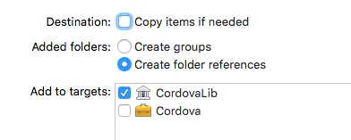
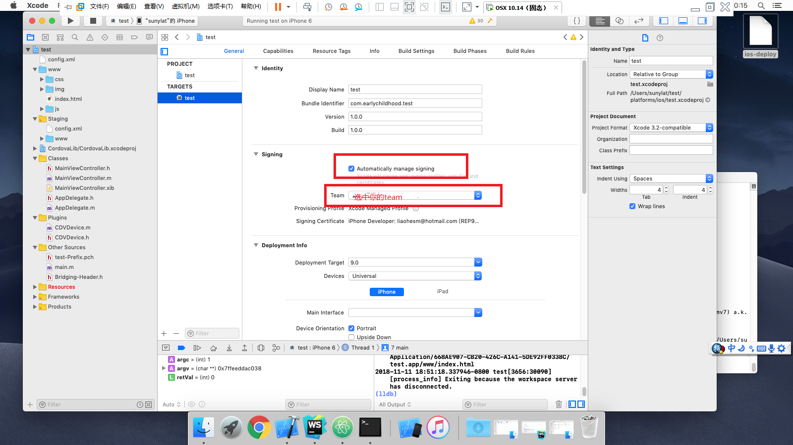
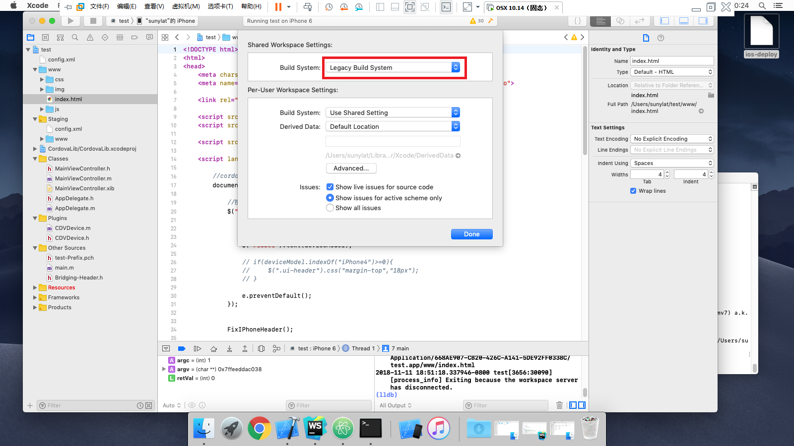

# 在使用cordova6.0的过程中，编译好的APP运行在IOS7+系统上默认是与状态栏重叠的，而运行在IOS6及老版本中时是于状态栏分离的。
## 解决办法：把文件 platforms/ios/CodeServerApp/Classes/MainViewController.m 中的方法viewWillAppear进行相关修改如下。 作用是更改view的边界，使其下移20px，刚好是状态栏的高度。

```
- (void)viewWillAppear:(BOOL)animated
{
    if([[[UIDevice currentDevice]systemVersion ] floatValue]>=7)
    {
        CGRect viewBounds=[self.webView  bounds];
        viewBounds.origin.y=20;
        viewBounds.size.height=viewBounds.size.height-20;
        self.webView.frame=viewBounds;
    }
    [super viewWillAppear:animated];
}
```


# Cordova中iOS端访问远程web链接调用Cordova插件
## platforms/ios/CordovaLib/Classes/Public/
## CDVURLProtocolCustom.h
```
#import <Foundation/Foundation.h>
#import <UIKit/UIKit.h>

@interface CDVURLProtocolCustom : NSURLProtocol

@end
```

## CDVURLProtocolCustom.m
```
#import "CDVURLProtocolCustom.h"
#import <CoreServices/CoreServices.h>

@interface CDVURLProtocolCustom ()

@end

NSString* const kCDVAssetsLibraryPrefixes = @"http://injection/cordova.js";

@implementation CDVURLProtocolCustom

// 这个方法用来拦截H5页面请求
+ (BOOL)canInitWithRequest:(NSURLRequest*)theRequest
{
    NSURL* theUrl = [theRequest URL];
    
    // 判断是否是我们定义的url，若是，返回YES，继续执行其他方法，若不是，返回NO，不执行其他方法
    if ([[theUrl absoluteString] hasPrefix:kCDVAssetsLibraryPrefixes] && [[theUrl absoluteString] hasSuffix:@".js"]) {
        return YES;
    }
    
    return NO;
}

+ (NSURLRequest*)canonicalRequestForRequest:(NSURLRequest*)request
{
    // NSLog(@"%@ received %@", self, NSStringFromSelector(_cmd));
    return request;
}
// 获取本地文件路径
- (NSString*)pathForResource:(NSString*)resourcepath
{
    NSBundle* mainBundle = [NSBundle mainBundle];
    NSMutableArray* directoryParts = [NSMutableArray arrayWithArray:[resourcepath componentsSeparatedByString:@"/"]];
    NSString* filename = [directoryParts lastObject];
    
    [directoryParts removeLastObject];
    NSString* directoryPartsJoined = [directoryParts componentsJoinedByString:@"/"];
    NSString* directoryStr = @"www";
    
    if ([directoryPartsJoined length] > 0) {
        directoryStr = [NSString stringWithFormat:@"%@/%@", directoryStr, [directoryParts componentsJoinedByString:@"/"]];
    }
    
    return [mainBundle pathForResource:filename ofType:@"" inDirectory:directoryStr];
}

// 在canInitWithRequest方法返回YES以后，会执行该方法，完成替换资源并返回给H5页面
- (void)startLoading
{
    // NSLog(@"%@ received %@ - start", self, NSStringFromSelector(_cmd));
    NSString* url=super.request.URL.resourceSpecifier;
    NSString* cordova = [url stringByReplacingOccurrencesOfString:@"//injection/" withString:@""];
    NSURL* startURL = [NSURL URLWithString:cordova];
    
    
    NSString* cordovaFilePath =[self pathForResource:[startURL path]];
    if (!cordovaFilePath) {
        [self sendResponseWithResponseCode:401 data:nil mimeType:nil];//重要
        return;
    }
    CFStringRef pathExtension = (__bridge_retained CFStringRef)[cordovaFilePath pathExtension];
    CFStringRef type = UTTypeCreatePreferredIdentifierForTag(kUTTagClassFilenameExtension, pathExtension, NULL);
    CFRelease(pathExtension);
    NSString *mimeType = (__bridge_transfer NSString *)UTTypeCopyPreferredTagWithClass(type, kUTTagClassMIMEType);
    if (type != NULL)
        CFRelease(type);
    //    NSURLResponse *response = [[NSURLResponse alloc] initWithURL:super.request.URL    MIMEType:mimeType expectedContentLength:-1 textEncodingName:nil];
    NSData* data = [NSData dataWithContentsOfFile:cordovaFilePath];
    [self sendResponseWithResponseCode:200 data:data mimeType:mimeType];
}


- (void)stopLoading
{
    // do any cleanup here
}

+ (BOOL)requestIsCacheEquivalent:(NSURLRequest*)requestA toRequest:(NSURLRequest*)requestB
{
    return NO;
}

// 将本地资源返回给H5页面
- (void)sendResponseWithResponseCode:(NSInteger)statusCode data:(NSData*)data mimeType:(NSString*)mimeType
{
    if (mimeType == nil) {
        mimeType = @"text/plain";
    }
    
    NSHTTPURLResponse* response = [[NSHTTPURLResponse alloc] initWithURL:[[self request] URL] statusCode:statusCode HTTPVersion:@"HTTP/1.1" headerFields:@{@"Content-Type" : mimeType}];
    
    [[self client] URLProtocol:self didReceiveResponse:response cacheStoragePolicy:NSURLCacheStorageNotAllowed];
    if (data != nil) {
        [[self client] URLProtocol:self didLoadData:data];
    }
    [[self client] URLProtocolDidFinishLoading:self];
}

@end
```

## 在CDVAppdelegate的application:(UIApplication*)application didFinishLaunchingWithOptions:方法中添加
```
[NSURLProtocol registerClass:[CDVURLProtocolCustom class]];
```
## 在CDVAppdelegate.m 添加
```
#import "CDVURLProtocolCustom.h"
```
## 用xcode 打开xcodeproj项目，将两个文件加入到public

## 保证苹果开发证书正常可用。打开工程之后，如果没有加入苹果ID，则加入，加入后，下载全部证书，随后在工程里面设置“Automatically manage signing”，随后选对“team”。

### build.json放置到根目录
```
{
    "ios": {
      "debug": {
        "codeSignIdentity": "iPhone Development",
        "developmentTeam": "teamID",
        "packageType": "development",
        "automaticProvisioning": true,
        "buildFlag": [
          "EMBEDDED_CONTENT_CONTAINS_SWIFT = YES",
          "ALWAYS_EMBED_SWIFT_STANDARD_LIBRARIES=NO",
          "LD_RUNPATH_SEARCH_PATHS = \"@executable_path/Frameworks\"",
           "-UseModernBuildSystem=0"
      ]
      },
      "release": {
        "codeSignIdentity": "iPhone Development",
        "developmentTeam": "teamID",
        "packageType": "app-store",
        "automaticProvisioning": true,
        "buildFlag": [
          "EMBEDDED_CONTENT_CONTAINS_SWIFT = YES",
          "ALWAYS_EMBED_SWIFT_STANDARD_LIBRARIES=NO",
          "LD_RUNPATH_SEARCH_PATHS = \"@executable_path/Frameworks\"",
           "-UseModernBuildSystem=0"
      ]
      }
    }
  }
```
## 修改编译选项：把“Build System”修改成“Legacy Build System”。
